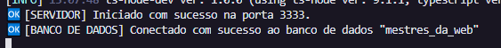

# Desafio Mestres da Web

# 📦 Requisitos
1. Docker (https://docs.docker.com/docker-for-windows/install/)
2. NodeJS (https://nodejs.org/en/download/)
3. NPM ou Yarn (https://nodejs.org/en/download/)
4. PostgreSQL (https://www.postgresql.org/download/windows/)
5. Imsomnia (https://insomnia.rest/download/)

# 🔧 Instalação do Projeto
Crie um banco de dados com nome 'mestres_da_web' em algum container de sua preferencia.

Após baixar o projeto e criar o banco de dados, rode o comando 'npm install' ou 'yarn'. Logo após, crie as tabelas com o comando 'yarn typeorm migration:run'
Para iniciliazar o projeto, rode 'yarn dev'.

Se tudo acontecer como o esperado, voce irá ver esse log:

# 💭 Sobre o projeto

O projeto conta com duas tabelas: 'shops' (lojas) e 'products' (produtos), sendo um relacionamento de UMA loja para MUITOS produtos (OneToMany).

O projeto conta tambem com CRUDS para ambas as tabelas.

# 🎟 JWT
Todas as rotas com excessão de 'listar todos os produtos', 'login' e 'criar shop' PRECISAM de um token JWT que é gerado na rota Login, pois é no token que se localiza a coluna 'shop_id'.

# 🟣 Teste com o Insomnia  
Na raíz do projeto, existe um arquivo insomnia.json, que possui um workspace já configurado para testes no Insomnia.

