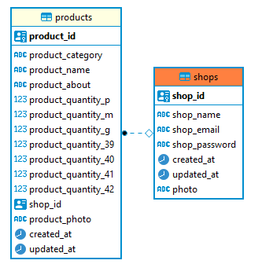

# Desafio Mestres da Web

# 📦 Requisitos
1. Docker (https://docs.docker.com/docker-for-windows/install/)
2. NodeJS (https://nodejs.org/en/download/)
3. NPM ou Yarn (https://nodejs.org/en/download/)
4. PostgreSQL (https://www.postgresql.org/download/windows/)
5. Imsomnia (https://insomnia.rest/download/)
6. DBeaver (https://dbeaver.io/)

# 🔧 Instalação do Projeto
Crie um banco de dados com nome 'mestres_da_web' em algum container de sua preferencia.

Após baixar o projeto e criar o banco de dados, rode o comando 'npm install' ou 'yarn'. Logo após, crie as tabelas com o comando 'yarn typeorm migration:run'
Para iniciliazar o projeto, rode 'yarn dev'.

Se tudo acontecer como o esperado, voce irá ver esse log:

# 💭 Sobre o projeto

O projeto conta com duas tabelas: 'shops' (lojas) e 'products' (produtos), sendo um relacionamento de UMA loja para MUITOS produtos (OneToMany).

O projeto conta tambem com CRUDS para ambas as tabelas.

# 🎟 JWT
Todas as rotas com excessão de 'login' e 'criar shop' PRECISAM de um token JWT que é gerado na rota Login, pois é no token que se localiza a coluna 'shop_id'.

# 🚷 Middleware de autenticação
O middleware de autenticação recebe o token JWT através do req.headers.authorization e retorna apenas o campo 'sub' do token, sendo ele o id do shop. Caso o token seja inválido, o usuario nao consegue acessar as rotas autenticadas.

# 🖼 Sistema de Imagens
Cada tabela possui um sistema de imagem e um arquivo controlador para cada.
O sistema de imagem funciona da seguinte maneira:
Todo usuario por padrão possui uma imagem 'blank.jpg' (que nunca pode ser deletada).

Para atualizar essa foto, é chamada a rota '/products/photo/:product_id' (para a tabela de produtos) e '/shops/photo/' (para a tabela de shops), ambas as rotas são autenticadas por JWT.

Para nao sobrecarregar o armazenamento,  toda vez que um shop/produto atualiza a sua foto, a foto anterior é excluida (com excessão da 'blank.jpg')

# 🎲 Banco de Dados
Foi utilizado PostgreSQL na aplicação com DBeaver.

# 🟣 Teste com o Insomnia  
Na raíz do projeto, existe um arquivo insomnia.json, que possui um workspace já configurado para testes no Insomnia.

# ℹ Minha dificuldade
A tabela de produtos foi a tabela que eu senti duvida, pois nao sabia como lidar com as SKRUs, fiquei me questionando se colocava as quantidades em uma tabela separada, ou de que forma eu resolveria esse problema. Cheguei a conclusão de que seria melhor colococar todas as colunas de quantidades na mesma tabela e definir o valor padrão de todas as colunas relacionadas a quantidade como ZERO (0).
